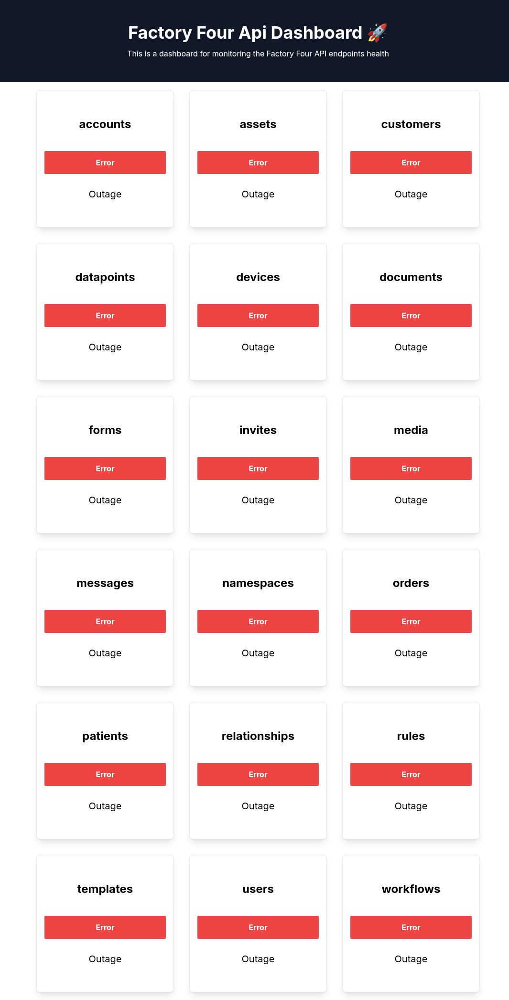

# Factory Four Health Dashboard

A real-time dashboard that monitors the health status of Factory Four services.

## Overview

This application provides a visual representation of various Factory Four service statuses in a clean, responsive dashboard format. The dashboard auto-refreshes every 15 seconds to ensure data is current and displays key metrics for each service including:

- Current status (Healthy/Unhealthy)
- Response time
- Last update timestamp

## Features

- **Real-time Monitoring**: Auto-refreshes data every 15 seconds
- **Visual Status Indicators**: Clearly shows healthy vs. unhealthy services
- **Responsive Design**: Works on desktop and mobile devices
- **Performance Metrics**: Displays response time for each service
- **Timestamp Tracking**: Shows when each service was last checked

## Technology Stack

- **React**: Front-end library for building the user interface
- **TypeScript**: Type safety throughout the application
- **Tailwind CSS**: Utility-first CSS framework for styling
- **Axios**: HTTP client for making API requests
- **date-fns**: Date manipulation library

## API Information

The dashboard connects to the Factory Four status API endpoints at:

https://api.factoryfour.com/{service}/health/status
